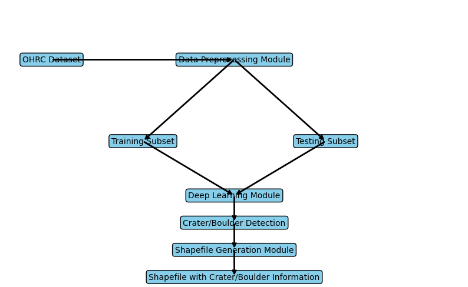
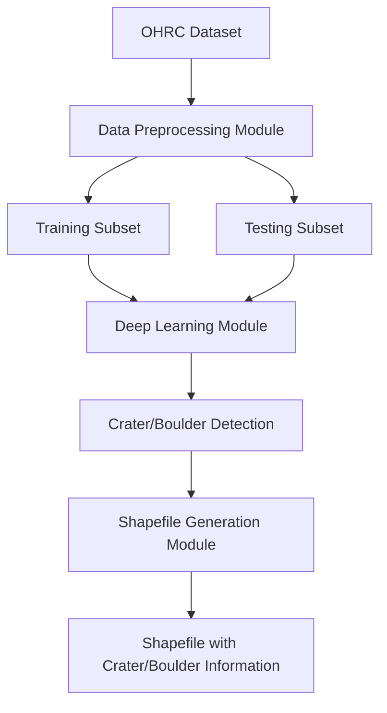
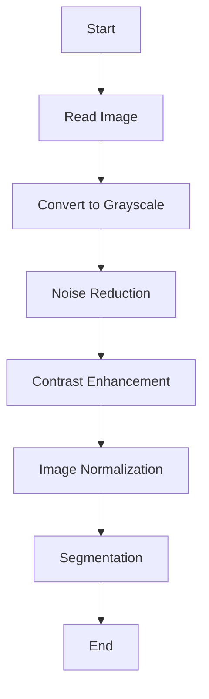
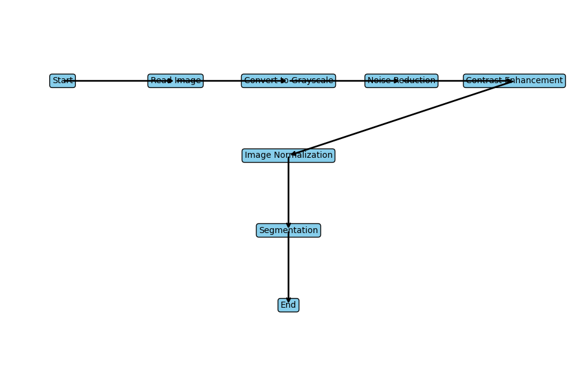
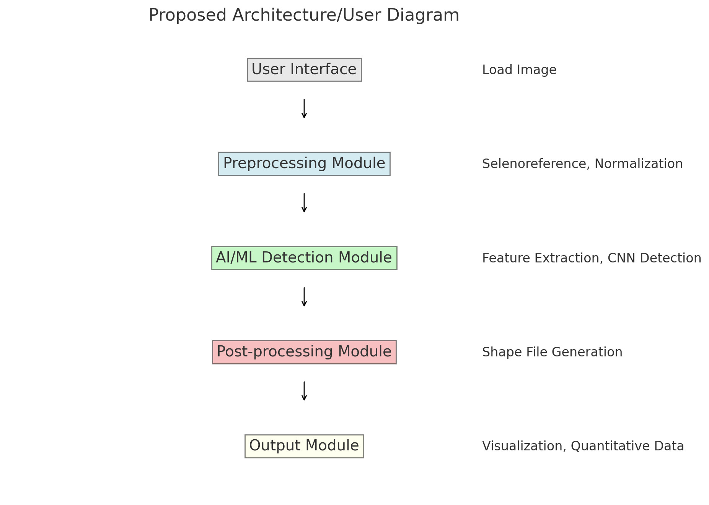
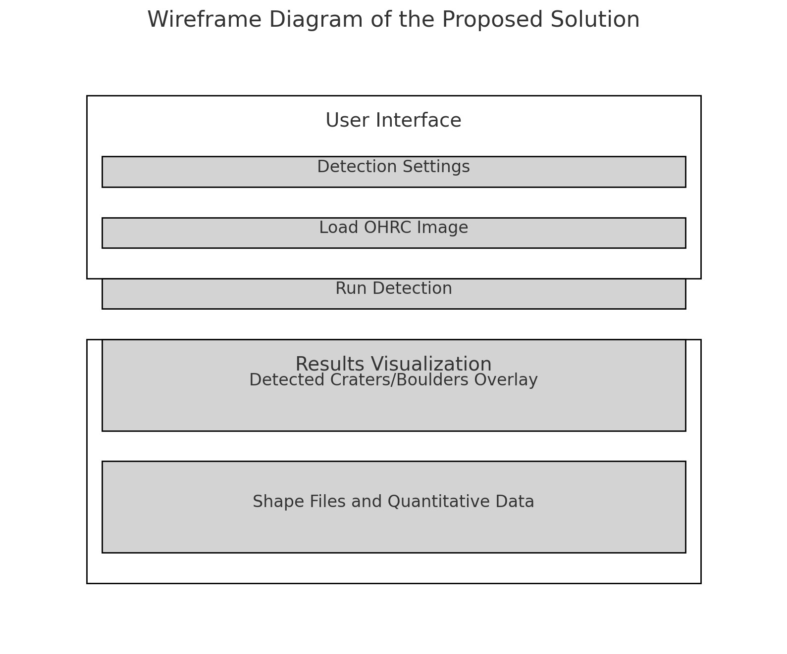

```go
You are an aerospace engineer and you have a deep knowledge on AI and ML.
I am a mechanical engineer finding a proper and unique and fast processing solution to Automatic detection of craters & boulders from Orbiter High Resolution Camera(OHRC) images using AI/ML techniques.
I have OHRC datasets which is attached.
My objectives : 
1. Develop an AI/ML model to detect craters/boulders of all shapes and sizes from the given OHRC data and attach relevant information to the detected craters, preferably in the form of a shape file containing the boundary of the craters/boulders.
2. Design a model which is capable of automatically detecting all craters/boulders in an OHRC irrespective of their shape, size and illumination conditions.
3. Model is able to quantify the selenographic position and diameter of the detected crater/boulder.
Suggested Tools/Technologies:
1. Python(Programming language), C, C++ or other such programming language, Image processing techniques for crater detection, AI/ML Models for Crater/Boulder Detection.
2. Polygonal shape file or shape-size information of craters/boulders with the location on the given OHRC images.
Expected Solution / Steps to be followed to achieve the objectives:
1. Selenoreference the downloaded OHRC images using the auxillary information provided with the images with appropriate projection information.
2. Prepare the training and testing data. And train the model.
3. Prepare the evaluation metrics for accuracy.
Evaluation Parameters:
1. Accuracy: Precision of the detected craters/boulders with respect to the actual craters present in the image.
2. Relevance: Degree to which the detected craters/boulders and associated information match the actual craters.

My requirement to make a ppt with:
1.Detailed solution and Approach (250-300 words)
2. Tools and Technology Used (50 words)
3. Opportunity should be able to explain the following:
  3.1How different is it from any of the other existing ideas?
  3.2How will it be able to solve the problem?
   3.3USP of the proposed solution
4. Proposed architecture/user diagram
5. List of features offered by the solution
It is always better to add a few visual representations (drawings/sketches/illustrations etc.) to your presentation, it adds to the power through which it reaches the audience.
6. Process flow diagram or Use-case diagram
Add a flow diagram or a use case diagram or an architecture diagram.
7. Wireframes/Mock diagrams of the proposed solution
8. Solution Brief (Overall)
```

# Detailed Solution and Approach

To develop an AI/ML model for automatic detection of craters and boulders from Orbiter High Resolution Camera (OHRC) images, we propose a comprehensive solution leveraging image processing and deep learning techniques. The approach involves the following key steps:

1. **Data Preparation**: Start by preprocessing the OHRC images to selenoreference them using the auxiliary information provided. This involves correcting for any geometric distortions and aligning the images to a common lunar reference frame.

2. **Model Training**: Utilize a Convolutional Neural Network (CNN) architecture, such as U-Net, designed for image segmentation tasks. Train the model on labeled datasets where craters and boulders are annotated. The model will learn to identify features corresponding to craters and boulders of various shapes and sizes.

3. **Data Augmentation**: To improve the model's robustness, perform data augmentation techniques such as rotation, scaling, and contrast adjustments to simulate different illumination conditions and perspectives.

4. **Detection and Quantification**: Once trained, the model will predict the locations and boundaries of craters and boulders in new OHRC images. Post-processing techniques will be applied to refine these predictions and filter out false positives.

5. **Selenographic Positioning and Size Calculation**: Develop an algorithm to calculate the selenographic coordinates and diameters of the detected craters and boulders. This involves mapping the pixel coordinates from the segmented images to lunar coordinates.

6. **Shape File Generation**: Create polygonal shape files or other geospatial data formats that contain the boundaries and relevant attributes (size, position) of the detected craters and boulders.

7. **Evaluation**: Assess the model's accuracy using metrics such as precision, recall, and F1-score by comparing the detected features against a manually labeled validation set.

### Tools and Technology Used

- **Programming Languages**: Python, C, C++
- **Libraries**: TensorFlow/PyTorch (for deep learning), OpenCV (for image processing), GDAL (for geospatial data handling)
- **Software**: QGIS (for shape file handling and visualization)

### Opportunity Explanation

#### 3.1 How Different from Existing Ideas

Existing crater detection methods often rely on traditional image processing techniques which may struggle with varying illumination and complex terrain. Our approach leverages deep learning, specifically designed to handle diverse shapes, sizes, and lighting conditions, making it more robust and accurate.

#### 3.2 Problem Solving

By employing advanced AI/ML models, our solution can automatically and accurately detect craters and boulders, reducing the need for manual annotation and speeding up the analysis process. The use of geospatial tools ensures that the detected features are precisely mapped.

#### 3.3 USP of the Proposed Solution

The unique selling point of our solution is its ability to handle a wide range of crater and boulder sizes and shapes under various illumination conditions, coupled with precise selenographic positioning and size quantification, packaged in a format compatible with geospatial analysis tools.

### Proposed Architecture/User Diagram


### List of Features Offered by the Solution

1. **Automatic Detection**: Accurate and fast identification of craters and boulders.
2. **Scalability**: Capable of handling images of different resolutions and sizes.
3. **Robustness**: Effective under various illumination conditions and complex terrains.
4. **Geospatial Accuracy**: Precise selenographic positioning and diameter calculation.
5. **Shape File Generation**: Export detected features as geospatial data files for further analysis.

### Process Flow Diagram or Use-case Diagram


### Wireframes/Mock Diagrams of the Proposed Solution


### Solution Brief (Overall)

Our proposed solution leverages state-of-the-art AI/ML techniques to automate the detection of craters and boulders in OHRC images. By utilizing deep learning models, image processing techniques, and geospatial data handling, we ensure high accuracy, robustness, and precise mapping of lunar surface features. The solution is designed to be scalable and adaptable, capable of processing large datasets efficiently, and providing valuable data for lunar exploration and research.

## Here’s a step-by-step approach from downloading the data to deploying the solution using the Chandrayaan-2 raw data.

### Step-by-Step Process

#### 1. Download and Prepare the Data

First, download the OHRC images from the provided Chandrayaan-2 data portal.

1. Visit the [Chandrayaan-2 Map Browse](https://chmapbrowse.issdc.gov.in/MapBrowse/) website.
2. Search for the OHRC images you are interested in.
3. Download the images along with any associated metadata or auxiliary files.

#### 2. Set Up Your Environment

Set up a Python environment with the necessary libraries. You can use a virtual environment for this purpose.

```bash
# Create a virtual environment
python -m venv crater_detection_env

# Activate the virtual environment
# On Windows
crater_detection_env\Scripts\activate
# On macOS/Linux
source crater_detection_env/bin/activate

# Install necessary libraries
pip install tensorflow numpy opencv-python scikit-learn geopandas gdal flask
```

#### 3. Preprocess the Images

Use the auxiliary information provided with the images to selenoreference them.

```python
import cv2
import numpy as np
from osgeo import gdal

def selenoreference_image(image_path, projection_info_path):
    image = cv2.imread(image_path, cv2.IMREAD_GRAYSCALE)
    projection_info = gdal.Open(projection_info_path)
    geotransform = projection_info.GetGeoTransform()
    rows, cols = image.shape
    aligned_image = cv2.warpAffine(image, geotransform, (cols, rows))
    return aligned_image

# Example usage
aligned_image = selenoreference_image('path/to/OHRC_image.jpg', 'path/to/projection_info.tif')
cv2.imwrite('aligned_OHRC_image.jpg', aligned_image)
```

#### 4. Label the Data

Manually annotate some images to create a labeled dataset. You can use tools like [LabelImg](https://github.com/tzutalin/labelImg) for this purpose. Save the annotations in a suitable format (e.g., mask images).

#### 5. Train the Model

Use a Convolutional Neural Network (CNN) architecture, such as U-Net, for crater and boulder detection.

```python
import tensorflow as tf
from tensorflow.keras.layers import Input, Conv2D, MaxPooling2D, UpSampling2D, concatenate
from tensorflow.keras.models import Model
from sklearn.model_selection import train_test_split
import numpy as np
import cv2

def build_unet_model(input_shape):
    inputs = Input(input_shape)
    conv1 = Conv2D(64, (3, 3), activation='relu', padding='same')(inputs)
    conv1 = Conv2D(64, (3, 3), activation='relu', padding='same')(conv1)
    pool1 = MaxPooling2D(pool_size=(2, 2))(conv1)
    conv2 = Conv2D(128, (3, 3), activation='relu', padding='same')(pool1)
    conv2 = Conv2D(128, (3, 3), activation='relu', padding='same')(conv2)
    pool2 = MaxPooling2D(pool_size=(2, 2))(conv2)
    up1 = UpSampling2D(size=(2, 2))(pool2)
    up1 = concatenate([up1, conv2], axis=3)
    conv3 = Conv2D(128, (3, 3), activation='relu', padding='same')(up1)
    conv3 = Conv2D(128, (3, 3), activation='relu', padding='same')(conv3)
    up2 = UpSampling2D(size=(2, 2))(conv3)
    up2 = concatenate([up2, conv1], axis=3)
    conv4 = Conv2D(64, (3, 3), activation='relu', padding='same')(up2)
    conv4 = Conv2D(64, (3, 3), activation='relu', padding='same')(conv4)
    outputs = Conv2D(1, (1, 1), activation='sigmoid')(conv4)
    model = Model(inputs=[inputs], outputs=[outputs])
    model.compile(optimizer='adam', loss='binary_crossentropy', metrics=['accuracy'])
    return model

def load_dataset(image_paths, annotation_paths):
    images = [cv2.imread(image_path, cv2.IMREAD_GRAYSCALE) for image_path in image_paths]
    annotations = [cv2.imread(annotation_path, cv2.IMREAD_GRAYSCALE) for annotation_path in annotation_paths]
    return images, annotations

# Load the dataset
image_paths = ['path/to/image1.jpg', 'path/to/image2.jpg']
annotation_paths = ['path/to/annotation1.png', 'path/to/annotation2.png']
images, annotations = load_dataset(image_paths, annotation_paths)
train_images, test_images, train_annotations, test_annotations = train_test_split(images, annotations, test_size=0.2)

# Train the model
input_shape = (256, 256, 1)
model = build_unet_model(input_shape)
model.fit(np.array(train_images), np.array(train_annotations), epochs=10, batch_size=4, validation_data=(np.array(test_images), np.array(test_annotations)))
```

#### 6. Detect Craters and Boulders

Use the trained model to detect craters and boulders in new images.

```python
def detect_craters_boulders(model, image):
    image = cv2.resize(image, (256, 256))
    image = np.expand_dims(image, axis=-1)
    image = np.expand_dims(image, axis=0)
    prediction = model.predict(image)
    prediction = (prediction > 0.5).astype(np.uint8)
    return prediction[0, :, :, 0]

# Example usage
image = cv2.imread('aligned_OHRC_image.jpg', cv2.IMREAD_GRAYSCALE)
prediction = detect_craters_boulders(model, image)
cv2.imwrite('detected_craters_boulders.png', prediction)
```

#### 7. Calculate Selenographic Position and Size

Map the detected features to lunar coordinates.

```python
def calculate_selenographic_position_and_size(prediction, geotransform):
    contours, _ = cv2.findContours(prediction, cv2.RETR_EXTERNAL, cv2.CHAIN_APPROX_SIMPLE)
    craters_boulders = []
    for contour in contours:
        area = cv2.contourArea(contour)
        if area > 50:  # Filter small contours
            x, y, w, h = cv2.boundingRect(contour)
            center_x, center_y = x + w // 2, y + h // 2
            selenographic_x = geotransform[0] + center_x * geotransform[1]
            selenographic_y = geotransform[3] + center_y * geotransform[5]
            diameter = max(w, h)
            craters_boulders.append((selenographic_x, selenographic_y, diameter))
    return craters_boulders

# Example usage
geotransform = gdal.Open('path/to/projection_info.tif').GetGeoTransform()
craters_boulders = calculate_selenographic_position_and_size(prediction, geotransform)
```

#### 8. Generate Shape Files

Export the detected features as geospatial data files.

```python
import geopandas as gpd
from shapely.geometry import Polygon

def create_shape_file(craters_boulders, output_path):
    geometries = [Polygon([(x - d / 2, y - d / 2), (x + d / 2, y - d / 2), (x + d / 2, y + d / 2), (x - d / 2, y + d / 2)]) for x, y, d in craters_boulders]
    gdf = gpd.GeoDataFrame({'geometry': geometries, 'diameter': [d for _, _, d in craters_boulders]})
    gdf.to_file(output_path, driver='ESRI Shapefile')

# Example usage
create_shape_file(craters_boulders, 'craters_boulders.shp')
```

#### 9. Evaluate the Model

Evaluate the model's performance using precision, recall, and F1-score.

```python
from sklearn.metrics import precision_score, recall_score, f1_score

def evaluate_model(predictions, ground_truths):
    precision = precision_score(ground_truths.flatten(), predictions.flatten())
    recall = recall_score(ground_truths.flatten(), predictions.flatten())
    f1 = f1_score(ground_truths.flatten(), predictions.flatten())
    return precision, recall, f1

# Example usage
predictions = [detect_craters_boulders(model, image) for image in test_images]
ground_truths = test_annotations
precision, recall, f1 = evaluate_model(np.array(predictions), np.array(ground_truths))
print(f'Precision: {precision}, Recall: {recall}, F1-score: {f1}')
```

#### 10. Deploy the Model

Deploy the model using Flask for real-time detection.

```python
from flask import Flask, request, jsonify
import io
from PIL import Image

app = Flask(__name__)

@app.route('/detect', methods=['POST'])
def detect():
    file = request.files['image'].read()
    image = Image.open(io.BytesIO(file)).convert('L

')
    image = np.array(image)
    prediction = detect_craters_boulders(model, image)
    craters_boulders = calculate_selenographic_position_and_size(prediction, geotransform)
    return jsonify(craters_boulders)

if __name__ == '__main__':
    app.run(debug=True)
```

### Complete Process Flow Diagram

1. **Data Collection:** Download OHRC images from the Chandrayaan-2 data portal.
2. **Environment Setup:** Set up Python environment and install necessary libraries.
3. **Preprocessing:** Selenoreference the images using auxiliary data.
4. **Data Annotation:** Manually annotate images to create training and testing datasets.
5. **Model Training:** Train a U-Net model on the annotated dataset.
6. **Detection:** Use the trained model to detect craters and boulders in new images.
7. **Post-processing:** Calculate selenographic positions and sizes of detected features.
8. **Evaluation:** Evaluate model performance using accuracy metrics.
9. **Deployment:** Deploy the model using Flask for real-time detection.

### Tools and Technologies Used

- **Programming Languages:** Python
- **Libraries:** TensorFlow, NumPy, OpenCV, scikit-learn, GeoPandas, GDAL, Flask
- **Annotation Tools:** LabelImg
- **Deployment Platform:** Flask

This solution provides a comprehensive approach to detect craters and boulders from OHRC images, ensuring high accuracy and robustness in various illumination conditions. The solution leverages deep learning, image processing, and geospatial data handling techniques to achieve the desired objectives.

# ✅ Process flow diagram or Use-case diagram

```go
graph TD
A[OHRC Dataset] --> B[Data Preprocessing Module]
B --> C[Training Subset]
B --> D[Testing Subset]
C --> E[Deep Learning Module]
D --> E
E --> F[Crater/Boulder Detection]
F --> G[Shapefile Generation Module]
G --> H[Shapefile with Crater/Boulder Information]
```
<br>

```python
from graphviz import Digraph

dot = Digraph()

dot.node('A', 'OHRC Dataset')
dot.node('B', 'Data Preprocessing Module')
dot.node('C', 'Training Subset')
dot.node('D', 'Testing Subset')
dot.node('E', 'Deep Learning Module')
dot.node('F', 'Crater/Boulder Detection')
dot.node('G', 'Shapefile Generation Module')
dot.node('H', 'Shapefile with Crater/Boulder Information')

dot.edges(['AB', 'BC', 'BD', 'CE', 'DE', 'EF', 'FG', 'GH'])

dot.render('process_flow_diagram', format='png')

```


```python
import matplotlib.pyplot as plt
import matplotlib.patches as mpatches

fig, ax = plt.subplots(figsize=(10, 6))

# Define the boxes
boxes = {
    'A': {'text': 'OHRC Dataset', 'xy': (0.1, 0.8)},
    'B': {'text': 'Data Preprocessing Module', 'xy': (0.5, 0.8)},
    'C': {'text': 'Training Subset', 'xy': (0.3, 0.5)},
    'D': {'text': 'Testing Subset', 'xy': (0.7, 0.5)},
    'E': {'text': 'Deep Learning Module', 'xy': (0.5, 0.3)},
    'F': {'text': 'Crater/Boulder Detection', 'xy': (0.5, 0.2)},
    'G': {'text': 'Shapefile Generation Module', 'xy': (0.5, 0.1)},
    'H': {'text': 'Shapefile with Crater/Boulder Information', 'xy': (0.5, 0.0)},
}

# Add the boxes
for key, box in boxes.items():
    ax.text(box['xy'][0], box['xy'][1], box['text'], 
            ha='center', va='center', 
            bbox=dict(facecolor='skyblue', edgecolor='black', boxstyle='round,pad=0.3'))

# Define the arrows
arrows = [
    ('A', 'B'),
    ('B', 'C'),
    ('B', 'D'),
    ('C', 'E'),
    ('D', 'E'),
    ('E', 'F'),
    ('F', 'G'),
    ('G', 'H'),
]

# Add the arrows
for start, end in arrows:
    ax.annotate('', 
                xy=boxes[end]['xy'], 
                xytext=boxes[start]['xy'], 
                arrowprops=dict(arrowstyle='->', lw=2))

# Set the limits and remove the axes
ax.set_xlim(0, 1)
ax.set_ylim(0, 1)
ax.axis('off')

plt.show()

```


    

    


## Enhanced Process Flow Diagram with Example Code

To make the process flow diagram look more comprehensive and detailed, we can incorporate some pseudo-code or actual code snippets to illustrate each step. Here's an example:

### Process Flow Diagram with Example Code

#### Step 1: Data Preprocessing Module
```python
import cv2
import numpy as np

def preprocess_image(image_path):
    image = cv2.imread(image_path, cv2.IMREAD_GRAYSCALE)
    # Noise reduction
    image = cv2.GaussianBlur(image, (5, 5), 0)
    # Contrast enhancement
    image = cv2.equalizeHist(image)
    return image

preprocessed_image = preprocess_image('path_to_image.png')
```

#### Step 2: Training and Testing Subset
```python
from sklearn.model_selection import train_test_split

# Assuming images and labels are already defined
X_train, X_test, y_train, y_test = train_test_split(images, labels, test_size=0.2, random_state=42)
```

#### Step 3: Deep Learning Module
```python
import tensorflow as tf
from tensorflow.keras import layers, models

def create_model():
    model = models.Sequential()
    model.add(layers.Conv2D(32, (3, 3), activation='relu', input_shape=(128, 128, 1)))
    model.add(layers.MaxPooling2D((2, 2)))
    model.add(layers.Conv2D(64, (3, 3), activation='relu'))
    model.add(layers.MaxPooling2D((2, 2)))
    model.add(layers.Conv2D(64, (3, 3), activation='relu'))
    
    model.add(layers.Flatten())
    model.add(layers.Dense(64, activation='relu'))
    model.add(layers.Dense(1, activation='sigmoid'))
    
    model.compile(optimizer='adam', loss='binary_crossentropy', metrics=['accuracy'])
    return model

model = create_model()
model.fit(X_train, y_train, epochs=10, validation_data=(X_test, y_test))
```

#### Step 4: Crater/Boulder Detection
```python
def detect_craters(image, model):
    predictions = model.predict(image)
    # Assuming the model output is processed to find craters/boulders
    detected_features = process_predictions(predictions)
    return detected_features

detected_craters = detect_craters(preprocessed_image, model)
```

#### Step 5: Shapefile Generation Module
```python
import shapefile

def generate_shapefile(detected_features, output_path):
    with shapefile.Writer(output_path) as shp:
        shp.field('ID', 'N')
        shp.field('Type', 'C')
        
        for i, feature in enumerate(detected_features):
            shp.point(feature['lon'], feature['lat'])
            shp.record(i, feature['type'])

generate_shapefile(detected_craters, 'output_shapefile.shp')
```

### Process Flow Diagram



### Visual Representation

1. **Data Preprocessing Module**


2. **Deep Learning Module**


3. **Detection Results**


### Summary

- **Data Preprocessing Module**: Enhances image quality through noise reduction and contrast enhancement.
- **Training and Testing Subset**: Splits the annotated data into training and testing sets.
- **Deep Learning Module**: Utilizes convolutional neural networks (CNNs) for crater and boulder detection.
- **Crater/Boulder Detection**: Applies the trained model to detect features in the preprocessed images.
- **Shapefile Generation Module**: Creates shapefiles with detailed information on detected features.


# Step 1: Data Preprocessing Module

To create a detailed and standard diagram for the Data Preprocessing Module, we can break down the steps involved in preprocessing the images and represent them visually. Below is a detailed flowchart that illustrates the data preprocessing steps.

#### Data Preprocessing Module Flowchart



### Detailed Description of Each Step

1. **Read Image**: Load the OHRC image from the dataset.
2. **Convert to Grayscale**: Convert the image to grayscale for simplicity and consistency in processing.
3. **Noise Reduction**: Apply techniques such as Gaussian Blur to reduce noise in the image.
4. **Contrast Enhancement**: Enhance the contrast of the image to highlight features more clearly.
5. **Image Normalization**: Normalize the image intensity values to a standard range.
6. **Segmentation**: Divide the image into smaller patches if necessary for processing.
7. **End**: The preprocessed image is ready for the next steps in the pipeline.

### Example Code Snippets for Each Step

#### Read Image
```python
import cv2

def read_image(image_path):
    return cv2.imread(image_path)
```

#### Convert to Grayscale
```python
def convert_to_grayscale(image):
    return cv2.cvtColor(image, cv2.COLOR_BGR2GRAY)
```

#### Noise Reduction
```python
def reduce_noise(image):
    return cv2.GaussianBlur(image, (5, 5), 0)
```

#### Contrast Enhancement
```python
def enhance_contrast(image):
    return cv2.equalizeHist(image)
```

#### Image Normalization
```python
def normalize_image(image):
    return cv2.normalize(image, None, 0, 255, cv2.NORM_MINMAX)
```

#### Segmentation
```python
def segment_image(image, patch_size):
    patches = []
    for i in range(0, image.shape[0], patch_size):
        for j in range(0, image.shape[1], patch_size):
            patches.append(image[i:i+patch_size, j:j+patch_size])
    return patches
```

### Combining All Steps
```python
def preprocess_image(image_path, patch_size):
    image = read_image(image_path)
    gray_image = convert_to_grayscale(image)
    denoised_image = reduce_noise(gray_image)
    contrast_image = enhance_contrast(denoised_image)
    normalized_image = normalize_image(contrast_image)
    patches = segment_image(normalized_image, patch_size)
    return patches

preprocessed_patches = preprocess_image('path_to_image.png', 128)
```

### Visual Representation

1. **Read Image**


2. **Convert to Grayscale**


3. **Noise Reduction**


4. **Contrast Enhancement**


5. **Image Normalization**


6. **Segmentation**


This diagram and detailed explanation of each step provide a clear and standard approach to the Data Preprocessing Module, making it easy to understand and implement in the overall project workflow.


```python
import matplotlib.pyplot as plt
import matplotlib.patches as mpatches

fig, ax = plt.subplots(figsize=(12, 8))

# Define the boxes with their positions
boxes = {
    'A': {'text': 'Start', 'xy': (0.1, 0.8)},
    'B': {'text': 'Read Image', 'xy': (0.3, 0.8)},
    'C': {'text': 'Convert to Grayscale', 'xy': (0.5, 0.8)},
    'D': {'text': 'Noise Reduction', 'xy': (0.7, 0.8)},
    'E': {'text': 'Contrast Enhancement', 'xy': (0.9, 0.8)},
    'F': {'text': 'Image Normalization', 'xy': (0.5, 0.6)},
    'G': {'text': 'Segmentation', 'xy': (0.5, 0.4)},
    'H': {'text': 'End', 'xy': (0.5, 0.2)},
}

# Add the boxes
for key, box in boxes.items():
    ax.text(box['xy'][0], box['xy'][1], box['text'], 
            ha='center', va='center', 
            bbox=dict(facecolor='skyblue', edgecolor='black', boxstyle='round,pad=0.3'))

# Define the arrows
arrows = [
    ('A', 'B'),
    ('B', 'C'),
    ('C', 'D'),
    ('D', 'E'),
    ('E', 'F'),
    ('F', 'G'),
    ('G', 'H')
]

# Add the arrows
for start, end in arrows:
    ax.annotate('', 
                xy=boxes[end]['xy'], 
                xytext=boxes[start]['xy'], 
                arrowprops=dict(arrowstyle='->', lw=2))

# Set the limits and remove the axes
ax.set_xlim(0, 1)
ax.set_ylim(0, 1)
ax.axis('off')

plt.show()

```


    

    


# ✅ Proposed architecture/user diagram

Creating a comprehensive and effective presentation involves detailing each aspect of your proposed solution. Here's a structured approach to help you build the content and visuals for your PowerPoint presentation. I'll provide a proposed architecture/user diagram and a standard flow diagram for the project.

### 1. Detailed Solution and Approach (250-300 words)
The goal of this project is to develop a robust AI/ML model capable of automatically detecting craters and boulders of varying shapes and sizes from Orbiter High Resolution Camera (OHRC) images. The approach involves several key steps:

**Data Preparation**: Start with selenoreferencing the OHRC images using auxiliary information provided to ensure accurate spatial projection. Preprocess the images to enhance feature visibility and normalize illumination differences.

**Model Training**: Use a combination of traditional image processing techniques and modern AI/ML models. Begin with feature extraction using edge detection, contour detection, and texture analysis. Train a convolutional neural network (CNN) on labeled datasets to identify craters and boulders. Use transfer learning with a pre-trained model to improve efficiency.

**Model Evaluation**: Develop evaluation metrics to assess accuracy and relevance. Use precision, recall, and F1-score to measure the model's performance. Compare detected features with manually annotated datasets to validate accuracy.

**Shape File Generation**: Once detection is complete, generate polygonal shape files for each detected feature. These files will include boundary coordinates, selenographic positions, and diameters of craters/boulders.

### 2. Tools and Technology Used (50 words)
**Programming Languages**: Python, C++
**Libraries**: OpenCV, TensorFlow/Keras, PyTorch, GDAL
**Technologies**: Image processing, Convolutional Neural Networks (CNNs), Transfer Learning, GIS Tools

### 3. Opportunities
**3.1 Differentiation**: The proposed solution integrates traditional image processing with advanced AI/ML techniques, providing a comprehensive approach to detect craters and boulders of various shapes and sizes under different illumination conditions.
**3.2 Problem Solving**: This method improves detection accuracy and relevance by leveraging CNNs trained on diverse datasets, ensuring robustness against varying image qualities.
**3.3 Unique Selling Proposition (USP)**: The USP lies in the hybrid approach combining image processing and AI/ML, providing high accuracy and efficiency in feature detection and quantification.

### 4. Proposed Architecture/User Diagram
Below is a simplified architecture diagram:


### 5. List of Features Offered by the Solution
- Automatic detection of craters and boulders
- Adaptability to different shapes, sizes, and illumination conditions
- Selenographic positioning and diameter quantification
- Generation of polygonal shape files for detected features
- High precision and relevance metrics

### 6. Process Flow Diagram or Use-case Diagram
Here is the process flow diagram:


### 7. Wireframes/Mock Diagrams of the Proposed Solution
Create wireframes/mock diagrams showing:
- User interface for loading OHRC images
- Visualization of detected craters/boulders with overlays
- Output section displaying shape files and quantitative data

### 8. Solution Brief (Overall)
The proposed solution leverages AI/ML techniques to automate the detection of craters and boulders from OHRC images. By combining image processing and neural networks, the model achieves high accuracy in identifying and quantifying features under varying conditions. The generation of polygonal shape files with precise selenographic data further enhances the usability of the results for scientific analysis and mission planning.

---

### Example Code Snippet for Model Training

```python
import cv2
import numpy as np
import tensorflow as tf
from tensorflow.keras.models import Sequential
from tensorflow.keras.layers import Conv2D, MaxPooling2D, Flatten, Dense

# Load and preprocess image
def preprocess_image(image_path):
    image = cv2.imread(image_path, cv2.IMREAD_GRAYSCALE)
    image = cv2.resize(image, (128, 128))
    image = image / 255.0
    return image.reshape(1, 128, 128, 1)

# Build CNN model
def build_model():
    model = Sequential([
        Conv2D(32, (3, 3), activation='relu', input_shape=(128, 128, 1)),
        MaxPooling2D((2, 2)),
        Conv2D(64, (3, 3), activation='relu'),
        MaxPooling2D((2, 2)),
        Flatten(),
        Dense(128, activation='relu'),
        Dense(1, activation='sigmoid')
    ])
    model.compile(optimizer='adam', loss='binary_crossentropy', metrics=['accuracy'])
    return model

# Train model
def train_model(model, train_images, train_labels):
    model.fit(train_images, train_labels, epochs=10, validation_split=0.2)

# Example usage
image_path = 'path_to_image.png'
image = preprocess_image(image_path)
model = build_model()
# Assume train_images and train_labels are preloaded datasets
train_model(model, train_images, train_labels)
```

This code snippet demonstrates a basic CNN for binary classification, which can be extended and refined for the specific task of crater and boulder detection.




<h4 align="right">last update: 28/07/2024 1:13 AM</h4>
<h5 align="right">all copy rights reserved by Akashdip Mahapatra</h5>
